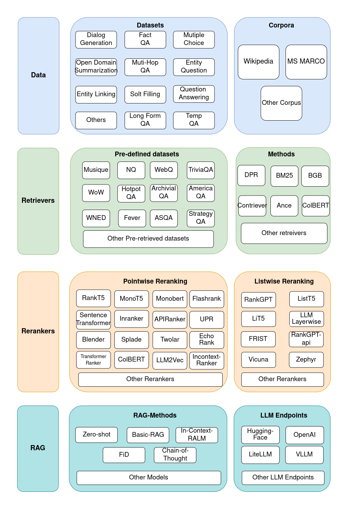

<div align="center">

[ [English](README.md) | [中文](README_zh.md)]


### 🔥 Rankify: A Comprehensive Python Toolkit for Retrieval, Re-Ranking, and Retrieval-Augmented Generation 🔥

<!-- First row of badges -->
<div style="display: flex; flex-wrap: wrap; align-items: center; justify-content: center; gap: 8px; margin-bottom: 8px;">
  <a href="https://arxiv.org/abs/2502.02464">
    
  </a>
  <a href="https://huggingface.co/datasets/abdoelsayed/reranking-datasets">
    
  </a>
  <a href="https://huggingface.co/datasets/abdoelsayed/reranking-datasets-light">
    
  </a>
  <a href="#">
    
  </a>
  <a href="https://opensource.org/license/apache-2-0">
    
  </a>
</div>

<!-- Second row of badges -->
<div style="display: flex; flex-wrap: wrap; align-items: center; justify-content: center; gap: 8px; margin-bottom: 8px;">
  <a href="https://pepy.tech/projects/rankify">
    
  </a>
  <a href="https://github.com/DataScienceUIBK/rankify/releases">
    
  </a>
  <a href="https://star-history.com/#DataScienceUIBK/Rankify">
    
  </a>
  <a href="#">
    
  </a>
  <a href="https://gitcode.com/abdoelsayed2016/Rankify">
    
  </a>
</div>

<!-- Product Hunt badge -->
<div style="margin-top: 10px;">
  <a href="https://www.producthunt.com/products/github-113?embed=true&utm_source=badge-featured&utm_medium=badge&utm_source=badge-github&#0045;73d2dbbf&#0045;d84f&#0045;495d&#0045;86d8&#0045;af4dd72fc31f">
    
  </a>
</div>

</div>


If you like our Framework, **don't hesitate to ⭐ star this repository ⭐**. This helps us to **make the Framework more better and scalable to different models and methods 🤗**.

<!-- -->


_A modular and efficient retrieval, reranking  and RAG  framework designed to work with state-of-the-art models for retrieval, ranking and rag tasks._

_Rankify is a Python toolkit designed for unified retrieval, re-ranking, and retrieval-augmented generation (RAG) research. Our toolkit integrates 40 pre-retrieved benchmark datasets and supports 7 retrieval techniques, 24 state-of-the-art re-ranking models, and multiple RAG methods. With a flexible generator architecture supporting multiple endpoints, Rankify provides a modular and extensible framework, enabling seamless experimentation and benchmarking across retrieval pipelines. Comprehensive documentation, open-source implementation, and pre-built evaluation tools make Rankify a powerful resource for researchers and practitioners in the field._

<!-- <p align="center">

</p> -->

---
## 🚀 Demo

To run the demo locally:

```bash
# Make sure Rankify is installed
pip install streamlit

# Then run the demo
streamlit run demo.py
```

https://github.com/user-attachments/assets/13184943-55db-4f0c-b509-fde920b809bc


---

## :link: Navigation
- [Features](#-features)
- [Roadmap](#-roadmap)
- [Installation](#-installation)
- [Quick Start](#rocket-quick-start)
- [Indexing](#cli-running-indexing-module)
- [Retrievers](#2️⃣-running-retrieval)
- [Re-Rankers](#3️⃣-running-reranking)
- [Generators](#4️⃣-using-generator-module)
- [Evaluation](#5️⃣-evaluating-with-metrics)
- [Documentation](#📖-documentation)
- [Community Contributing](#-Community-Contributions)
- [Contributing](#-contributing)
- [License](#bookmark-license)
- [Acknowledgments](#-acknowledgments)
- [Citation](#star2-citation)


## 🎉News

- **[2025-06-11]** Many thanks to [@tobias124](https://github.com/tobias124) for implementing [Indexing](#cli-running-indexing-module) for Custom Dataset.

- **[2025-06-01]** Many thanks to [@aherzinger](https://github.com/aherzinger) for implementing and refactoring the Generator and RAG models.

- **[2025-05-30]** Huge thanks to [@baraayusry](https://github.com/baraayusry) for implementing the Online Retriever using CrawAI and ReACT.

- **[2025-02-10]** Released [reranking-datasets](https://huggingface.co/datasets/abdoelsayed/reranking-datasets) and [reranking-datasets-light](https://huggingface.co/datasets/abdoelsayed/reranking-datasets-light) on Hugging Face.

- **[2025-02-04]** Our [paper](https://arxiv.org/abs/2502.02464) is released on arXiv.


## 🔧 Installation  

#### Set up the virtual environment
First, create and activate a conda environment with Python 3.10:

```bash
conda create -n rankify python=3.10
conda activate rankify
```
#### Install PyTorch 2.5.1
we recommend installing Rankify with PyTorch 2.5.1 for Rankify. Refer to the [PyTorch installation page](https://pytorch.org/get-started/previous-versions/) for platform-specific installation commands. 

If you have access to GPUs, it's recommended to install the CUDA version 12.4 or 12.6 of PyTorch, as many of the evaluation metrics are optimized for GPU use.

To install Pytorch 2.5.1 you can install it from the following cmd
```bash
pip install torch==2.5.1 torchvision==0.20.1 torchaudio==2.5.1 --index-url https://download.pytorch.org/whl/cu124
```


#### Basic Installation

To install **Rankify**, simply use **pip** (requires Python 3.10+):  
```base
pip install rankify
```

This will install the base functionality required for retrieval, re-ranking, and retrieval-augmented generation (RAG).  

#### Recommended Installation  

For full functionality, we **recommend installing Rankify with all dependencies**:
```bash
pip install "rankify[all]"
```
This ensures you have all necessary modules, including retrieval, re-ranking, and RAG support.

#### Optional Dependencies

If you prefer to install only specific components, choose from the following:
```bash
# Install dependencies for retrieval only (BM25, DPR, ANCE, etc.)
pip install "rankify[retriever]"

# Install base re-ranking with vLLM support for `FirstModelReranker`, `LiT5ScoreReranker`, `LiT5DistillReranker`, `VicunaReranker`, and `ZephyrReranker'.
pip install "rankify[reranking]"
```

Or, to install from **GitHub** for the latest development version:  


```bash
git clone https://github.com/DataScienceUIBK/rankify.git
cd rankify
pip install -e .
# For full functionality we recommend installing Rankify with all dependencies:
pip install -e ".[all]"
# Install dependencies for retrieval only (BM25, DPR, ANCE, etc.)
pip install -e ".[retriever]"
# Install base re-ranking with vLLM support for `FirstModelReranker`, `LiT5ScoreReranker`, `LiT5DistillReranker`, `VicunaReranker`, and `ZephyrReranker'.
pip install -e ".[reranking]"
```


#### Using ColBERT Retriever  

If you want to use **ColBERT Retriever**, follow these additional setup steps:
```bash
# Install GCC and required libraries
conda install -c conda-forge gcc=9.4.0 gxx=9.4.0
conda install -c conda-forge libstdcxx-ng
```
```bash
# Export necessary environment variables
export LD_LIBRARY_PATH=$CONDA_PREFIX/lib:$LD_LIBRARY_PATH
export CC=gcc
export CXX=g++
export PATH=$CONDA_PREFIX/bin:$PATH

# Clear cached torch extensions
rm -rf ~/.cache/torch_extensions/*
```

---

## :rocket: Quick Start

### **1️⃣ Pre-retrieved Datasets**  

We provide **1,000 pre-retrieved documents per dataset**, which you can download from:  

🔗 **[Hugging Face Dataset Repository](https://huggingface.co/datasets/abdoelsayed/reranking-datasets-light)**  

#### **Dataset Format**  

The pre-retrieved documents are structured as follows:
```json
[
    {
        "question": "...",
        "answers": ["...", "...", ...],
        "ctxs": [
            {
                "id": "...",         // Passage ID from database TSV file
                "score": "...",      // Retriever score
                "has_answer": true|false  // Whether the passage contains the answer
            }
        ]
    }
]
```


#### **Access Datasets in Rankify**  

You can **easily download and use pre-retrieved datasets** through **Rankify**.  

#### **List Available Datasets**  

To see all available datasets:
```python
from rankify.dataset.dataset import Dataset 

# Display available datasets
Dataset.avaiable_dataset()
```

**Retriever Datasets**
```python
from rankify.dataset.dataset import Dataset
# Download BM25-retrieved documents for nq-dev
dataset = Dataset(retriever="bm25", dataset_name="nq-dev", n_docs=100)
documents = dataset.download(force_download=False)
# Download BGE-retrieved documents for nq-dev
dataset = Dataset(retriever="bge", dataset_name="nq-dev", n_docs=100)
documents = dataset.download(force_download=False)
# Download ColBERT-retrieved documents for nq-dev
dataset = Dataset(retriever="colbert", dataset_name="nq-dev", n_docs=100)
documents = dataset.download(force_download=False)
# Download MSS-DPR-retrieved documents for nq-dev
dataset = Dataset(retriever="mss-dpr", dataset_name="nq-dev", n_docs=100)
documents = dataset.download(force_download=False)
# Download MSS-retrieved documents for nq-dev
dataset = Dataset(retriever="mss", dataset_name="nq-dev", n_docs=100)
documents = dataset.download(force_download=False)
# Download MSS-retrieved documents for nq-dev
dataset = Dataset(retriever="contriever", dataset_name="nq-dev", n_docs=100)
documents = dataset.download(force_download=False)
# Download ANCE-retrieved documents for nq-dev
dataset = Dataset(retriever="ance", dataset_name="nq-dev", n_docs=100)
documents = dataset.download(force_download=False)
```


**Load Pre-retrieved Dataset from File**  

If you have already downloaded a dataset, you can load it directly:
```python
from rankify.dataset.dataset import Dataset

# Load pre-downloaded BM25 dataset for WebQuestions
documents = Dataset.load_dataset('./tests/out-datasets/bm25/web_questions/test.json', 100)
```
Now, you can integrate **retrieved documents** with **re-ranking** and **RAG** workflows! 🚀  


#### Feature Comparison for Pre-Retrieved Datasets  

The following table provides an overview of the availability of different retrieval methods (**BM25, DPR, ColBERT, ANCE, BGE, Contriever**) for each dataset.  

✅ **Completed**
⏳  **Part Completed, Pending other Parts**
🕒 **Pending**  

<table style="width: 100%;">
  <tr>
    <th align="center">Dataset</th> 
    <th align="center">BM25</th> 
    <th align="center">DPR</th> 
    <th align="center">ColBERT</th>
    <th align="center">ANCE</th>
    <th align="center">BGE</th>
    <th align="center">Contriever</th>
  </tr>
  <tr>
    <td align="left">2WikimultihopQA</td>
    <td align="center">✅</td>
    <td align="center">🕒</td>
    <td align="center">🕒</td>
    <td align="center">🕒</td>
    <td align="center">🕒</td>
    <td align="center">🕒</td>
  </tr>
  <tr>
    <td align="left">ArchivialQA</td>
    <td align="center">✅</td>
    <td align="center">🕒</td>
    <td align="center">🕒</td>
    <td align="center">🕒</td>
    <td align="center">🕒</td>
    <td align="center">🕒</td>
  </tr>
  <tr>
    <td align="left">ChroniclingAmericaQA</td>
    <td align="center">✅</td>
    <td align="center">🕒</td>
    <td align="center">🕒</td>
    <td align="center">🕒</td>
    <td align="center">🕒</td>
    <td align="center">🕒</td>
  </tr>
  <tr>
    <td align="left">EntityQuestions</td>
    <td align="center">✅</td>
    <td align="center">🕒</td>
    <td align="center">🕒</td>
    <td align="center">🕒</td>
    <td align="center">🕒</td>
    <td align="center">🕒</td>
  </tr>
  <tr>
    <td align="left">AmbigQA</td>
    <td align="center">✅</td>
    <td align="center">🕒</td>
    <td align="center">✅</td>
    <td align="center">🕒</td>
    <td align="center">🕒</td>
    <td align="center">🕒</td>
  </tr>
  <tr>
    <td align="left">ARC</td>
    <td align="center">✅</td>
    <td align="center">🕒</td>
    <td align="center">🕒</td>
    <td align="center">🕒</td>
    <td align="center">🕒</td>
    <td align="center">🕒</td>
  </tr>
  <tr>
    <td align="left">ASQA</td>
    <td align="center">✅</td>
    <td align="center">🕒</td>
    <td align="center">🕒</td>
    <td align="center">🕒</td>
    <td align="center">🕒</td>
    <td align="center">🕒</td>
  </tr>
  <tr>
    <td align="left">MS MARCO</td>
    <td align="center">🕒</td>
    <td align="center">🕒</td>
    <td align="center">🕒</td>
    <td align="center">🕒</td>
    <td align="center">🕒</td>
    <td align="center">🕒</td>
  </tr>
  <tr>
    <td align="left">AY2</td>
    <td align="center">✅</td>
    <td align="center">🕒</td>
    <td align="center">🕒</td>
    <td align="center">🕒</td>
    <td align="center">🕒</td>
    <td align="center">🕒</td>
  </tr>
  <tr>
    <td align="left">Bamboogle</td>
    <td align="center">✅</td>
    <td align="center">🕒</td>
    <td align="center">🕒</td>
    <td align="center">🕒</td>
    <td align="center">🕒</td>
    <td align="center">🕒</td>
  </tr>
  <tr>
    <td align="left">BoolQ</td>
    <td align="center">✅</td>
    <td align="center">🕒</td>
    <td align="center">✅</td>
    <td align="center">🕒</td>
    <td align="center">✅</td>
    <td align="center">🕒</td>
  </tr>
  <tr>
    <td align="left">CommonSenseQA</td>
    <td align="center">✅</td>
    <td align="center">🕒</td>
    <td align="center">✅</td>
    <td align="center">🕒</td>
    <td align="center">✅</td>
    <td align="center">🕒</td>
  </tr>
  <tr>
    <td align="left">CuratedTREC</td>
    <td align="center">✅</td>
    <td align="center">🕒</td>
    <td align="center">✅</td>
    <td align="center">⏳</td>
    <td align="center">✅</td>
    <td align="center">🕒</td>
  </tr>
  <tr>
    <td align="left">ELI5</td>
    <td align="center">✅</td>
    <td align="center">🕒</td>
    <td align="center">🕒</td>
    <td align="center">🕒</td>
    <td align="center">🕒</td>
    <td align="center">🕒</td>
  </tr>
  <tr>
    <td align="left">FERMI</td>
    <td align="center">✅</td>
    <td align="center">🕒</td>
    <td align="center">✅</td>
    <td align="center">⏳</td>
    <td align="center">✅</td>
    <td align="center">🕒</td>
  </tr>
  <tr>
    <td align="left">FEVER</td>
    <td align="center">✅</td>
    <td align="center">🕒</td>
    <td align="center">🕒</td>
    <td align="center">🕒</td>
    <td align="center">🕒</td>
    <td align="center">🕒</td>
  </tr>
  <tr>
    <td align="left">HellaSwag</td>
    <td align="center">✅</td>
    <td align="center">🕒</td>
    <td align="center">🕒</td>
    <td align="center">🕒</td>
    <td align="center">🕒</td>
    <td align="center">🕒</td>
  </tr>
  <tr>
    <td align="left">HotpotQA</td>
    <td align="center">✅</td>
    <td align="center">🕒</td>
    <td align="center">🕒</td>
    <td align="center">🕒</td>
    <td align="center">🕒</td>
    <td align="center">🕒</td>
  </tr>
  <tr>
    <td align="left">MMLU</td>
    <td align="center">✅</td>
    <td align="center">🕒</td>
    <td align="center">🕒</td>
    <td align="center">🕒</td>
    <td align="center">🕒</td>
    <td align="center">🕒</td>
  </tr>
  <tr>
    <td align="left">Musique</td>
    <td align="center">✅</td>
    <td align="center">🕒</td>
    <td align="center">🕒</td>
    <td align="center">🕒</td>
    <td align="center">🕒</td>
    <td align="center">🕒</td>
  </tr>
    <tr>
    <td align="left">NarrativeQA</td>
    <td align="center">✅</td>
    <td align="center">🕒</td>
    <td align="center">✅</td>
    <td align="center">⏳</td>
    <td align="center">✅</td>
    <td align="center">🕒</td>
  </tr>
    <tr>
    <td align="left">NQ</td>
    <td align="center">✅</td>
    <td align="center">🕒</td>
    <td align="center">✅</td>
    <td align="center">⏳</td>
    <td align="center">✅</td>
    <td align="center">🕒</td>
  </tr>
    <tr>
    <td align="left">OpenbookQA</td>
    <td align="center">✅</td>
    <td align="center">🕒</td>
    <td align="center">🕒</td>
    <td align="center">🕒</td>
    <td align="center">🕒</td>
    <td align="center">🕒</td>
  </tr>
    <tr>
    <td align="left">PIQA</td>
    <td align="center">✅</td>
    <td align="center">🕒</td>
    <td align="center">✅</td>
    <td align="center">🕒</td>
    <td align="center">🕒</td>
    <td align="center">🕒</td>
  </tr>
    <tr>
    <td align="left">PopQA</td>
    <td align="center">✅</td>
    <td align="center">🕒</td>
    <td align="center">✅</td>
    <td align="center">⏳</td>
    <td align="center">✅</td>
    <td align="center">🕒</td>
  </tr>
    <tr>
    <td align="left">Quartz</td>
    <td align="center">✅</td>
    <td align="center">🕒</td>
    <td align="center">🕒</td>
    <td align="center">🕒</td>
    <td align="center">🕒</td>
    <td align="center">🕒</td>
  </tr>
    <tr>
    <td align="left">SIQA</td>
    <td align="center">✅</td>
    <td align="center">🕒</td>
    <td align="center">✅</td>
    <td align="center">🕒</td>
    <td align="center">✅</td>
    <td align="center">🕒</td>
  </tr>
    <tr>
    <td align="left">StrategyQA</td>
    <td align="center">✅</td>
    <td align="center">🕒</td>
    <td align="center">🕒</td>
    <td align="center">🕒</td>
    <td align="center">🕒</td>
    <td align="center">🕒</td>
  </tr>
    </tr>
    <tr>
    <td align="left">TREX</td>
    <td align="center">✅</td>
    <td align="center">🕒</td>
    <td align="center">🕒</td>
    <td align="center">🕒</td>
    <td align="center">🕒</td>
    <td align="center">🕒</td>
  </tr>
    </tr>
    <tr>
    <td align="left">TriviaQA</td>
    <td align="center">✅</td>
    <td align="center">🕒</td>
    <td align="center">✅</td>
    <td align="center">⏳</td>
    <td align="center">✅</td>
    <td align="center">🕒</td>
  </tr>
    </tr>
    <tr>
    <td align="left">TruthfulQA</td>
    <td align="center">✅</td>
    <td align="center">🕒</td>
    <td align="center">🕒</td>
    <td align="center">🕒</td>
    <td align="center">🕒</td>
    <td align="center">🕒</td>
  </tr>
      </tr>
    <tr>
    <td align="left">TruthfulQA</td>
    <td align="center">✅</td>
    <td align="center">🕒</td>
    <td align="center">🕒</td>
    <td align="center">🕒</td>
    <td align="center">🕒</td>
    <td align="center">🕒</td>
  </tr>
      </tr>
    <tr>
    <td align="left">WebQ</td>
    <td align="center">✅</td>
    <td align="center">🕒</td>
    <td align="center">✅</td>
    <td align="center">⏳</td>
    <td align="center">✅</td>
    <td align="center">🕒</td>
  </tr>
      </tr>
    <tr>
    <td align="left">WikiQA</td>
    <td align="center">✅</td>
    <td align="center">🕒</td>
    <td align="center">✅</td>
    <td align="center">⏳</td>
    <td align="center">✅</td>
    <td align="center">🕒</td>
  </tr>
      </tr>
    <tr>
    <td align="left">WikiAsp</td>
    <td align="center">✅</td>
    <td align="center">🕒</td>
    <td align="center">🕒</td>
    <td align="center">🕒</td>
    <td align="center">🕒</td>
    <td align="center">🕒</td>
  </tr>
        </tr>
    <tr>
    <td align="left">WikiPassageQA</td>
    <td align="center">✅</td>
    <td align="center">🕒</td>
    <td align="center">✅</td>
    <td align="center">⏳</td>
    <td align="center">✅</td>
    <td align="center">🕒</td>
  </tr>
        </tr>
    <tr>
    <td align="left">WNED</td>
    <td align="center">✅</td>
    <td align="center">🕒</td>
    <td align="center">🕒</td>
    <td align="center">🕒</td>
    <td align="center">🕒</td>
    <td align="center">🕒</td>
  </tr>
        </tr>
    <tr>
    <td align="left">WoW</td>
    <td align="center">✅</td>
    <td align="center">🕒</td>
    <td align="center">🕒</td>
    <td align="center">🕒</td>
    <td align="center">🕒</td>
    <td align="center">🕒</td>
  </tr>
        </tr>
    <tr>
    <td align="left">Zsre</td>
    <td align="center">✅</td>
    <td align="center">🕒</td>
    <td align="center">🕒</td>
    <td align="center">🕒</td>
    <td align="center">🕒</td>
    <td align="center">🕒</td>
  </tr>
</table>


---

### 2️⃣ Running Retrieval
To perform retrieval using **Rankify**, you can choose from various retrieval methods such as **BM25, DPR, ANCE, Contriever, ColBERT, and BGE**.  

**Example: Running Retrieval on Sample Queries**  
```python
from rankify.dataset.dataset import Document, Question, Answer, Context
from rankify.retrievers.retriever import Retriever

# Sample Documents
documents = [
    Document(question=Question("the cast of a good day to die hard?"), answers=Answer([
            "Jai Courtney",
            "Sebastian Koch",
            "Radivoje Bukvić",
            "Yuliya Snigir",
            "Sergei Kolesnikov",
            "Mary Elizabeth Winstead",
            "Bruce Willis"
        ]), contexts=[]),
    Document(question=Question("Who wrote Hamlet?"), answers=Answer(["Shakespeare"]), contexts=[])
]
```

```python
# BM25 retrieval on Wikipedia
bm25_retriever_wiki = Retriever(method="bm25", n_docs=5, index_type="wiki")

# BM25 retrieval on MS MARCO
bm25_retriever_msmacro = Retriever(method="bm25", n_docs=5, index_type="msmarco")


# DPR (multi-encoder) retrieval on Wikipedia
dpr_retriever_wiki = Retriever(method="dpr", model="dpr-multi", n_docs=5, index_type="wiki")

# DPR (multi-encoder) retrieval on MS MARCO
dpr_retriever_msmacro = Retriever(method="dpr", model="dpr-multi", n_docs=5, index_type="msmarco")

# DPR (single-encoder) retrieval on Wikipedia
dpr_retriever_wiki = Retriever(method="dpr", model="dpr-single", n_docs=5, index_type="wiki")

# DPR (single-encoder) retrieval on MS MARCO
dpr_retriever_msmacro = Retriever(method="dpr", model="dpr-single", n_docs=5, index_type="msmarco")

# ANCE retrieval on Wikipedia
ance_retriever_wiki = Retriever(method="ance", model="ance-multi", n_docs=5, index_type="wiki")

# ANCE retrieval on MS MARCO
ance_retriever_msmacro = Retriever(method="ance", model="ance-multi", n_docs=5, index_type="msmarco")


# Contriever retrieval on Wikipedia
contriever_retriever_wiki = Retriever(method="contriever", model="facebook/contriever-msmarco", n_docs=5, index_type="wiki")

# Contriever retrieval on MS MARCO
contriever_retriever_msmacro = Retriever(method="contriever", model="facebook/contriever-msmarco", n_docs=5, index_type="msmarco")


# ColBERT retrieval on Wikipedia
colbert_retriever_wiki = Retriever(method="colbert", model="colbert-ir/colbertv2.0", n_docs=5, index_type="wiki")

# ColBERT retrieval on MS MARCO
colbert_retriever_msmacro = Retriever(method="colbert", model="colbert-ir/colbertv2.0", n_docs=5, index_type="msmarco")


# BGE retrieval on Wikipedia
bge_retriever_wiki = Retriever(method="bge", model="BAAI/bge-large-en-v1.5", n_docs=5, index_type="wiki")

# BGE retrieval on MS MARCO
bge_retriever_msmacro = Retriever(method="bge", model="BAAI/bge-large-en-v1.5", n_docs=5, index_type="msmarco")


# Hyde retrieval on Wikipedia
hyde_retriever_wiki = Retriever(method="hyde" , n_docs=5, index_type="wiki", api_key=OPENAI_API_KEY )

# Hyde retrieval on MS MARCO
hyde_retriever_msmacro = Retriever(method="hyde", n_docs=5, index_type="msmarco", api_key=OPENAI_API_KEY)
```

**Running Retrieval**

After defining the retriever, you can retrieve documents using:
```python
retrieved_documents = bm25_retriever_wiki.retrieve(documents)

for i, doc in enumerate(retrieved_documents):
    print(f"\nDocument {i+1}:")
    print(doc)
```

---
## 3️⃣ Running Reranking
Rankify provides support for multiple reranking models. Below are examples of how to use each model.  

**Example: Reranking a Document**  
```python
from rankify.dataset.dataset import Document, Question, Answer, Context
from rankify.models.reranking import Reranking

# Sample document setup
question = Question("When did Thomas Edison invent the light bulb?")
answers = Answer(["1879"])
contexts = [
    Context(text="Lightning strike at Seoul National University", id=1),
    Context(text="Thomas Edison tried to invent a device for cars but failed", id=2),
    Context(text="Coffee is good for diet", id=3),
    Context(text="Thomas Edison invented the light bulb in 1879", id=4),
    Context(text="Thomas Edison worked with electricity", id=5),
]
document = Document(question=question, answers=answers, contexts=contexts)

# Initialize the reranker
reranker = Reranking(method="monot5", model_name="monot5-base-msmarco")

# Apply reranking
reranker.rank([document])

# Print reordered contexts
for context in document.reorder_contexts:
    print(f"  - {context.text}")
```


**Examples of Using Different Reranking Models**  
```python
# UPR
model = Reranking(method='upr', model_name='t5-base')

# API-Based Rerankers
model = Reranking(method='apiranker', model_name='voyage', api_key='your-api-key')
model = Reranking(method='apiranker', model_name='jina', api_key='your-api-key')
model = Reranking(method='apiranker', model_name='mixedbread.ai', api_key='your-api-key')

# Blender Reranker
model = Reranking(method='blender_reranker', model_name='PairRM')

# ColBERT Reranker
model = Reranking(method='colbert_ranker', model_name='Colbert')

# EchoRank
model = Reranking(method='echorank', model_name='flan-t5-large')

# First Ranker
model = Reranking(method='first_ranker', model_name='base')

# FlashRank
model = Reranking(method='flashrank', model_name='ms-marco-TinyBERT-L-2-v2')

# InContext Reranker
Reranking(method='incontext_reranker', model_name='llamav3.1-8b')

# InRanker
model = Reranking(method='inranker', model_name='inranker-small')

# ListT5
model = Reranking(method='listt5', model_name='listt5-base')

# LiT5 Distill
model = Reranking(method='lit5distill', model_name='LiT5-Distill-base')

# LiT5 Score
model = Reranking(method='lit5score', model_name='LiT5-Distill-base')

# LLM Layerwise Ranker
model = Reranking(method='llm_layerwise_ranker', model_name='bge-multilingual-gemma2')

# LLM2Vec
model = Reranking(method='llm2vec', model_name='Meta-Llama-31-8B')

# MonoBERT
model = Reranking(method='monobert', model_name='monobert-large')

# MonoT5
Reranking(method='monot5', model_name='monot5-base-msmarco')

# RankGPT
model = Reranking(method='rankgpt', model_name='llamav3.1-8b')

# RankGPT API
model = Reranking(method='rankgpt-api', model_name='gpt-3.5', api_key="gpt-api-key")
model = Reranking(method='rankgpt-api', model_name='gpt-4', api_key="gpt-api-key")
model = Reranking(method='rankgpt-api', model_name='llamav3.1-8b', api_key="together-api-key")
model = Reranking(method='rankgpt-api', model_name='claude-3-5', api_key="claude-api-key")

# RankT5
model = Reranking(method='rankt5', model_name='rankt5-base')

# Sentence Transformer Reranker
model = Reranking(method='sentence_transformer_reranker', model_name='all-MiniLM-L6-v2')
model = Reranking(method='sentence_transformer_reranker', model_name='gtr-t5-base')
model = Reranking(method='sentence_transformer_reranker', model_name='sentence-t5-base')
model = Reranking(method='sentence_transformer_reranker', model_name='distilbert-multilingual-nli-stsb-quora-ranking')
model = Reranking(method='sentence_transformer_reranker', model_name='msmarco-bert-co-condensor')

# SPLADE
model = Reranking(method='splade', model_name='splade-cocondenser')

# Transformer Ranker
model = Reranking(method='transformer_ranker', model_name='mxbai-rerank-xsmall')
model = Reranking(method='transformer_ranker', model_name='bge-reranker-base')
model = Reranking(method='transformer_ranker', model_name='bce-reranker-base')
model = Reranking(method='transformer_ranker', model_name='jina-reranker-tiny')
model = Reranking(method='transformer_ranker', model_name='gte-multilingual-reranker-base')
model = Reranking(method='transformer_ranker', model_name='nli-deberta-v3-large')
model = Reranking(method='transformer_ranker', model_name='ms-marco-TinyBERT-L-6')
model = Reranking(method='transformer_ranker', model_name='msmarco-MiniLM-L12-en-de-v1')

# TwoLAR
model = Reranking(method='twolar', model_name='twolar-xl')

# Vicuna Reranker
model = Reranking(method='vicuna_reranker', model_name='rank_vicuna_7b_v1')

# Zephyr Reranker
model = Reranking(method='zephyr_reranker', model_name='rank_zephyr_7b_v1_full')
```
---

## 4️⃣ Using Generator Module

Rankify provides a **Generator Module** for **retrieval-augmented generation (RAG)**, integrating retrieved documents with generative models like OpenAI, LiteLLM, vLLM, and Hugging Face. Its modular design allows easy addition of new **RAG methods** and **endpoints**, enabling seamless experimentation with approaches like zero-shot RAG, chain-of-thought RAG, and FiD-based RAG.  Below there are examples of how to use different RAG methods and how to include different LLM endpoints.

Please note that in order to use API-based endpoints (OpenAI, LiteLLM), you need to specify an api-key. See how to do this in our example below. 

**Examples of Using Different RAG methods and backends**  

```python
# Zero-shot with Huggingface endpoint
generator = Generator(method="zero-shot", model_name='meta-llama/Meta-Llama-3.1-8B-Instruct', backend="huggingface")

# Basic RAG with LiteLLM endpoint
generator = Generator(method="basic-rag", model_name='ollama/mistral', backend="litellm", api_key=api_key)

# Chain-of-Thought RAG with vLLM endpoint
generator = Generator(method="chain-of-thought-rag", model_name='mistralai/Mistral-7B-v0.1', backend="vllm")

# In-context-RALM with OpenAI endpoint
generator = Generator(method="in-context-ralm", model_name='gpt-3.5-turbo', backend="openai", api_keys=[api_key])
```

**Usage example without API-inference**

```python
from rankify.dataset.dataset import Document, Question, Answer, Context
from rankify.generator.generator import Generator

# Define question and answer
question = Question("What is the capital of Austria?")
answers=Answer("")
contexts = [
    Context(id=1, title="France", text="The capital of France is Paris.", score=0.9),
    Context(id=2, title="Germany", text="Berlin is the capital of Germany.", score=0.5)
]

# Construct document
doc = Document(question=question, answers=answers, contexts=contexts)

# Initialize Generator (e.g., Meta Llama)
generator = Generator(method="basic-rag", model_name='meta-llama/Meta-Llama-3.1-8B-Instruct', backend="huggingface")

# Generate answer
generated_answers = generator.generate([doc])
print(generated_answers)  # Output: ["Paris"]
```
**Usage example with API-inference**

Saving your API-keys in a .env.local file, you can access them via the listed methods:
```python
# in .env.local:
OPENAI_API_KEY=your-api-key
LITELLM_API_KEY=your-api-key
```
**Usage**
```python
# load LiteLLM api-key
api_key = get_litellm_api_key()
# load OpenAI api-key
api_key = get_openai_api_key()
```
**Full example using LiteLLM:**

```python
from rankify.dataset.dataset import Document, Question, Answer, Context
from rankify.generator.generator import Generator
from rankify.utils.models.rank_llm.rerank.api_keys import get_litellm_api_key

# Define question and answer
question = Question("What is the capital of France?")
answers = Answer([""])
contexts = [
    Context(id=1, title="France", text="The capital of France is Paris.", score=0.9),
    Context(id=2, title="Germany", text="Berlin is the capital of Germany.", score=0.5)
]

# Construct document
doc = Document(question=question, answers=answers, contexts=contexts)

#load api-key
api_key = get_litellm_api_key()

# Initialize Generator (e.g., Meta Llama)
generator = Generator(method="basic-rag", model_name='ollama/mistral', backend="litellm", api_key=api_key)

# Generate answer
generated_answers = generator.generate([doc])
print(generated_answers)  # Output: ["Paris"]
```

---
## CLI Running Indexing Module

Rankify provides a command-line interface (CLI) for indexing documents.\
You can create an index from a JSONL file containing documents, specifying the retriever and other parameters.

### BM25

``` bash
rankify-index index data/wikipedia_10k.jsonl --retriever bm25 --output rankify_indices
```

### DPR

wiki
``` bash
rankify-index index data/wikipedia_100.jsonl --retriever dpr --output rankify_indices
```

msmarco
``` bash
rankify-index index data/msmarco_100.jsonl --retriever dpr --output rankify_indices --index_type msmarco
```


### Contriever

``` bash
rankify-index index data/wikipedia_100.jsonl --retriever contriever --output rankify_indices/contriever
```

### ColBERT

``` bash
rankify-index index data/wikipedia_100.jsonl --retriever colbert --output rankify_indices/colbert
```

### BGE

``` bash
rankify-index index data/wikipedia_100.jsonl --retriever bge --output rankify_indices/bg
```

---
## 5️⃣ Evaluating with Metrics  

Rankify provides built-in **evaluation metrics** for **retrieval, re-ranking, and retrieval-augmented generation (RAG)**. These metrics help assess the quality of retrieved documents, the effectiveness of ranking models, and the accuracy of generated answers.  

**Evaluating Generated Answers**  

You can evaluate the quality of **retrieval-augmented generation (RAG) results** by comparing generated answers with ground-truth answers.
```python
from rankify.metrics.metrics import Metrics
from rankify.dataset.dataset import Dataset

# Load dataset
dataset = Dataset('bm25', 'nq-test', 100)
documents = dataset.download(force_download=False)

# Initialize Generator
generator = Generator(method="in-context-ralm", model_name='meta-llama/Llama-3.1-8B')

# Generate answers
generated_answers = generator.generate(documents)

# Evaluate generated answers
metrics = Metrics(documents)
print(metrics.calculate_generation_metrics(generated_answers))
```

**Evaluating Retrieval Performance**  

```python
# Calculate retrieval metrics before reranking
metrics = Metrics(documents)
before_ranking_metrics = metrics.calculate_retrieval_metrics(ks=[1, 5, 10, 20, 50, 100], use_reordered=False)

print(before_ranking_metrics)
```

**Evaluating Reranked Results**  
```python
# Calculate retrieval metrics after reranking
after_ranking_metrics = metrics.calculate_retrieval_metrics(ks=[1, 5, 10, 20, 50, 100], use_reordered=True)
print(after_ranking_metrics)
```


## 📜 Supported Models

### **1️⃣ Index**  
- ✅ **Wikipedia**
- ✅ **MS-MARCO**
- 🕒 **Online Search** 

### **1️⃣ Retrievers**  
- ✅ **[BM25](https://dl.acm.org/doi/10.1561/1500000019)**
- ✅ **[DPR](https://arxiv.org/abs/2004.04906)** 
- ✅ **[ColBERT](https://arxiv.org/abs/2004.12832)**   
- ✅ **[ANCE](https://arxiv.org/abs/2007.00808)**
- ✅ **[BGE](https://arxiv.org/abs/2402.03216)** 
- ✅ **[Contriever](https://arxiv.org/abs/2112.09118)** 
- ✅ **[BPR](https://arxiv.org/abs/2106.00882)** 
- ✅ **[HYDE](https://arxiv.org/abs/2212.10496)** 
- 🕒 **RepLlama**
- 🕒 **coCondenser**   
- 🕒 **Spar** 
- 🕒 **Dragon** 
- 🕒 **Hybird** 
---

### **2️⃣ Rerankers**  

- ✅ **[Cross-Encoders](https://huggingface.co/cross-encoder)** 
- ✅ **[RankGPT](https://arxiv.org/abs/2304.09542)**
- ✅ **[RankGPT-API](https://arxiv.org/abs/2304.09542)** 
- ✅ **[MonoT5](https://arxiv.org/abs/2003.06713)**
- ✅ **[MonoBert](https://arxiv.org/abs/1910.14424)**
- ✅ **[RankT5](https://arxiv.org/abs/2210.10634)** 
- ✅ **[ListT5](https://arxiv.org/abs/2402.15838)** 
- ✅ **[LiT5Score](https://arxiv.org/abs/2312.16098)**
- ✅ **[LiT5Dist](https://arxiv.org/abs/2312.16098)**
- ✅ **[Vicuna Reranker](https://arxiv.org/abs/2309.15088)**
- ✅ **[Zephyr Reranker](https://arxiv.org/abs/2312.02724)**
- ✅ **[Sentence Transformer-based](https://huggingface.co/sentence-transformers)** 
- ✅ **[FlashRank Models](https://github.com/PrithivirajDamodaran/FlashRank)**  
- ✅ **API-Based Rerankers**  
- ✅ **[ColBERT Reranker](https://arxiv.org/abs/2004.12832)**
- ✅ **LLM Layerwise Ranker** 
- ✅ **[Splade Reranker](https://dl.acm.org/doi/10.1145/3477495.3531857)**
- ✅ **[UPR Reranker](https://arxiv.org/abs/2204.07496)**
- ✅ **[Inranker Reranker](https://arxiv.org/abs/2401.06910)**
- ✅ **Transformer Reranker**
- ✅ **[FIRST Reranker](https://arxiv.org/abs/2411.05508)**
- ✅ **[Blender Reranker](https://arxiv.org/abs/2306.02561)**
- ✅ **[LLM2VEC Reranker](https://arxiv.org/abs/2404.05961)**
- ✅ **[ECHO Reranker](https://arxiv.org/abs/2402.10866)**
- ✅ **[Incontext Reranker](https://arxiv.org/abs/2410.02642)**
- 🕒 **DynRank**
- 🕒 **ASRank**
- 🕒 **RankLlama**

---

### **3️⃣ Generator**
#### **RAG-Methods**
- ✅ **Zero-shot**
- ✅ **Basic-RAG**
- ✅ **Chain-of-Thought-RAG**  
- ✅ **Fusion-in-Decoder (FiD) with T5**
- ✅ **In-Context Learning RALM**
- 🕒 **Self-Consistency RAG**
- 🕒 **Retrieval Chain-of-Thought**  

#### **LLM-Endpoints**
- ✅ **Hugging Face**
- ✅ **vLLM**
- ✅ **LiteLLM**  
- ✅ **OpenAI**

---


### **✨ Features**  

- 🔥 **Unified Framework**: Combines **retrieval**, **re-ranking**, and **retrieval-augmented generation (RAG)** into a single modular toolkit.  
- 📚 **Rich Dataset Support**: Includes **40+ benchmark datasets** with **pre-retrieved documents** for seamless experimentation.  
- 🧲 **Diverse Retrieval Methods**: Supports **BM25, DPR, ANCE, BPR, ColBERT, BGE, and Contriever** for flexible retrieval strategies.  
- 🎯 **Powerful Re-Ranking**: Implements **24 advanced models** with **41 sub-methods** to optimize ranking performance.  
- 🏗️ **Prebuilt Indices**: Provides **Wikipedia and MS MARCO** corpora, eliminating indexing overhead and speeding up retrieval.  
- 🔮 **Seamless RAG Integration**: Works with backends like **Hugging Face, OpenAI, vLLM, LiteLLM** inferening models like **GPT, LLAMA, T5, and Fusion-in-Decoder (FiD)** for multiple **retrieval-augmented generation** methods.  
- 🛠 **Extensible & Modular**: Easily integrates **custom datasets, retrievers, ranking models, and RAG pipelines**.  
- 📊 **Built-in Evaluation Suite**: Includes **retrieval, ranking, and RAG metrics** for robust benchmarking.  
- 📖 **User-Friendly Documentation**: Access detailed **[📖 online docs](http://rankify.readthedocs.io/)**, **example notebooks**, and **tutorials** for easy adoption.  
 

## 🔍 Roadmap  

**Rankify** is still under development, and this is our first release (**v0.1.0**). While it already supports a wide range of retrieval, re-ranking, and RAG techniques, we are actively enhancing its capabilities by adding more retrievers, rankers, datasets, and features.  


### **🛠 Planned Improvements**  

#### **Retrievers**  
✅ **Supports**: BM25, DPR, ANCE, BPR, ColBERT, BGE, Contriever  
✨ ⏳ **Coming Soon**: Spar, MSS, MSS-DPR  
✨ ⏳ **Custom Index Loading** for user-defined retrieval corpora  

#### **Re-Rankers**  
✅ **24 models & 41 sub-methods**  
✨ ⏳ **Expanding with more ranking models**  

#### **Datasets**  
✅ **40 benchmark datasets**  
✨ ⏳ **Adding new datasets & custom dataset integration**  

#### **Retrieval-Augmented Generation (RAG)**  
✅ **4 endpoints and 5 RAG-methods**    
✨ ⏳ **Expanding to more endpoints/RAG-methods**  

#### **Evaluation & Usability**  
✅ **Standard metrics**: Top-K, EM, Recall  
✨ ⏳ **Adding advanced metrics**: NDCG, MAP for retrievers  

#### **Pipeline Integration**  
✨ ⏳ **Introducing a pipeline module** for end-to-end retrieval, ranking, and RAG workflows  
--

## 📖 Documentation

For full API documentation, visit the [Rankify Docs](http://rankify.readthedocs.io/).

---

## 💡 Contributing


Follow these steps to get involved:

1. **Fork this repository** to your GitHub account.

2. **Create a new branch** for your feature or fix:

   ```bash
   git checkout -b feature/YourFeatureName
   ```

3. **Make your changes** and **commit them**:

   ```bash
   git commit -m "Add YourFeatureName"
   ```

4. **Push the changes** to your branch:

   ```bash
   git push origin feature/YourFeatureName
   ```

5. **Submit a Pull Request** to propose your changes.

Thank you for helping make this project better!

---

## 🌐 Community Contributions

 **Chinese community resources available!**  

Special thanks to [Xiumao](https://github.com/xiumao) for writing two exceptional Chinese blog posts about Rankify:  

> - 📘 [Introduction to Rankify](https://mp.weixin.qq.com/s/-dH64Q_KWvj8VQq7Ys383Q)  
> - 📘 [Deep dive into re-ranking models in Rankify](https://mp.weixin.qq.com/s/XcOmXGv4CqUIp0oBcOgltw)  

These articles were crafted with high-traffic optimization in mind and are widely recommended in Chinese academic and developer circles. 

We updated the [中文版本](README_zh.md) to reflect these blog contributions while keeping original content intact—thank you Xiumao for your continued support!


## :bookmark: License

Rankify is licensed under the Apache-2.0 License - see the [LICENSE](https://opensource.org/license/apache-2-0) file for details.


## 🙏 Acknowledgments  

We would like to express our gratitude to the following libraries, which have greatly contributed to the development of **Rankify**:  

- **Rerankers** – A powerful Python library for integrating various reranking methods.  
  🔗 [GitHub Repository](https://github.com/AnswerDotAI/rerankers/tree/main)  

- **Pyserini** – A toolkit for supporting BM25-based retrieval and integration with sparse/dense retrievers.  
  🔗 [GitHub Repository](https://github.com/castorini/pyserini)  

- **FlashRAG** – A modular framework for Retrieval-Augmented Generation (RAG) research.  
  🔗 [GitHub Repository](https://github.com/RUC-NLPIR/FlashRAG)  


## :star2: Citation

Please kindly cite our paper if helps your research:

```BibTex
@article{abdallah2025rankify,
  title={Rankify: A Comprehensive Python Toolkit for Retrieval, Re-Ranking, and Retrieval-Augmented Generation},
  author={Abdallah, Abdelrahman and Mozafari, Jamshid and Piryani, Bhawna and Ali, Mohammed and Jatowt, Adam},
  journal={arXiv preprint arXiv:2502.02464},
  year={2025}
}
```

## Star History


[](https://star-history.com/#DataScienceUIBK/Rankify&Date)


