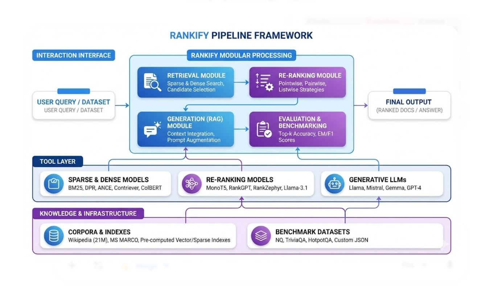

[ [English](README.md) | [中文](README_zh.md)]
# <p align="center"></p>
### <div align="center">🔥 Rankify: 一个全面的 Python 工具包，专为检索、重排序和检索增强生成（RAG）设计 🔥<div>

<div align="center">
<a href="https://arxiv.org/abs/2502.02464" target="_blank"></a>
<a href="https://huggingface.co/datasets/abdoelsayed/reranking-datasets" target="_blank"></a>
<a href="https://huggingface.co/datasets/abdoelsayed/reranking-datasets-light" target="_blank"></a>
<a></a>
<a href="https://opensource.org/license/apache-2-0"></a>
 <a href="https://pepy.tech/projects/rankify"></a>
<a href="https://github.com/DataScienceUIBK/rankify/releases"></a>  
<a href="https://star-history.com/#DataScienceUIBK/Rankify">  </a>  
</div>

如果你喜欢我们的框架，**请不要犹豫，⭐ 给这个仓库加星 ⭐**。这将帮助我们**使 Rankify 变得更强大，并扩展到更多模型和方法 🤗**。


---

_一个模块化且高效的检索、重排序和 RAG 框架，专为最新的检索、排序和 RAG 任务模型设计。_

_在自然语言处理和信息检索快速发展的领域中，高效查找、排序和利用相关信息的能力变得越来越重要。Rankify 作为这些挑战的强大解决方案应运而生，提供了一个专为检索、重排序和检索增强生成（RAG）任务设计的综合性 Python 工具包。_

_Rankify 是一个模块化且高效的框架，它无缝集成了整个信息检索流程中的最先进模型和技术。无论您是探索新排序算法的研究人员，构建问答系统的数据科学家，还是实现生产级 RAG 应用的开发人员，Rankify 都能提供满足您需求的工具和灵活性。_


## Rankify 的三个核心组件

Rankify 的核心围绕三个基本组件构建，这些组件共同创建了一个完整的信息检索和生成流程：

<p align="center">

</p>


### 检索器（Retrievers）
检索器构成了流程的第一阶段，负责高效搜索大型文档集合以找到潜在相关信息。Rankify 支持多种检索技术，从传统的稀疏方法如 BM25 到先进的密集检索方法，如 DPR（Dense Passage Retrieval）、ANCE、BGE 和 ColBERT。这些检索器擅长快速从成千上万或数百万文档中筛选出可管理的候选集，以供进一步处理。


### 重排序器（Rerankers）
一旦检索器识别出候选文档，重排序器就会介入以改进这些结果的排序。Rankify 实现了 24+ 种最先进的重排序模型，分为两大类：

- 逐点重排序（Pointwise Reranking）：如 RankT5、MonoT5、UPR 和 FlashRank 等独立评估每个文档的模型。

- 列表式重排序（Listwise Reranking）：更复杂的方法如 ListT5、RankGPT 和 LLM Layerwise 模型，考虑文档之间的关系以产生最佳排序。

重排序器通过对较小的检索文档集应用计算密集但更准确的相关性判断，显著提高了搜索结果的质量。

### 生成器（Generators）
流程中的最后一个组件，生成器利用检索和重排序的信息生成连贯、上下文相关的文本输出。Rankify 支持多种 RAG 方法，包括零样本（Zero-shot）、解码器融合（Fusion-in-Decoder，FiD）和上下文内（In-Context）方法。这些生成器通过结合大型语言模型和外部知识源的力量，实现了问答、内容摘要和基于知识的文本生成等应用。

## 主要特性和功能
Rankify 具有几个显著特点，使其成为信息检索和 RAG 应用的强大工具：

- 预检索基准数据集：访问 40 个预检索基准数据集，节省大量计算时间并实现与最先进方法的直接比较。
- 全面的模型支持：集成 7+ 种检索技术和 24+ 种重排序模型，代表信息检索研究的前沿。
- 自定义数据集支持：与内部或自定义数据集完全兼容，允许与现有数据流程无缝集成。
- 评估工具：内置指标和评估协议，用于衡量和比较不同检索和排序方法的性能。
- 优化性能：许多组件针对 GPU 加速进行了优化，能够高效处理大型文档集合。
- 详尽文档：全面的指南、教程和 API 参考，帮助用户快速入门并充分利用框架。

## 目标受众
Rankify 旨在服务多样化的用户群体：

- 研究人员：实验最先进的检索和排序方法，对新方法进行基准测试，加速信息检索和 RAG 研究。
- 数据科学家：构建强大的问答系统、文档检索应用和知识密集型 NLP 解决方案。
- 开发人员：使用灵活、模块化的组件实现生产级 RAG 应用，可根据特定需求进行定制。
- 教育工作者和学生：通过全面、文档完善的框架学习现代信息检索技术，说明关键概念和方法。

在接下来的部分，我们将详细探讨 Rankify 的每个组件，提供有关其实现、使用和最佳实践的见解。我们还将介绍安装选项、自定义数据集支持和实用示例，帮助您开始使用这个强大的工具包。

## 安装和使用
开始使用 Rankify 非常简单，提供灵活的安装选项以适应不同的需求和用例。本节提供了安装 Rankify、设置环境和实现基本使用模式的全面指南，帮助您快速利用这个工具包的强大功能。

### 安装选项
Rankify 设计为默认模块化和轻量级。这种方法允许用户只安装他们需要的组件，最小化特定用例的依赖项和资源需求。

## 安装和使用
开始使用 Rankify 非常简单，提供灵活的安装选项以适应不同的需求和用例。本节提供了安装 Rankify、设置环境和实现基本使用模式的全面指南，帮助您快速利用这个工具包的强大功能。

### 安装选项
Rankify 设计为默认模块化和轻量级。这种方法允许用户只安装他们需要的组件，最小化特定用例的依赖项和资源需求。

### 基本安装
对于核心功能，您可以使用 pip 安装 Rankify：

```bash
pip install rankify
```
这个基本安装提供：

- 核心框架组件
- 基本重排序功能
- 最小依赖项
- 支持检索增强生成（RAG）

基本安装适合希望快速入门或主要需要核心重排序功能而不需要高级检索或专业重排序模型所需的额外依赖项的用户。

## 组件特定安装
对于更专业的需求，Rankify 提供组件特定的安装选项：

### 用于检索功能（BM25、DPR、ANCE 等）：

```bash 
pip install "rankify[retriever]"
```
此安装添加：

- 密集检索模型
- 向量索引库
- 文档处理工具
- 检索评估指标

### 用于高级重排序功能：

```bash
pip install "rankify[reranking]"
```

此安装包括：

- vLLM 支持高效推理
- 用于列表式重排序的 FlashAttention
- 额外的重排序模型
- 重排序评估工具

## 整安装
对于需要 Rankify 完整功能的用户，包括所有检索器、重排序器和生成器：
```bash
pip install "rankify[all]"
```
这个全面安装提供：

- 所有检索技术
- 所有重排序模型
- 所有 RAG 方法
- 完整评估套件
- 所有优化工具

### 开发安装

对于贡献者或想要最新开发版本的用户：
```bash
git clone https://github.com/DataScienceUIBK/rankify.git
cd rankify
pip install -e .
```
对于完整的开发环境：
```bash
pip install -e ".[all]"
```
## 环境设置
Python 版本要求
Rankify 需要 Python 3.10 或更高版本。我们建议使用 conda 设置专用环境：
```bash
conda create -n rankify python=3.10
conda activate rankify
```

PyTorch 安装
Rankify 与 PyTorch 2.5.1 配合最佳。为获得最佳性能，特别是使用 GPU 加速：
```bash
pip install torch==2.5.1 torchvision==0.20.1 torchaudio==2.5.1 --index-url https://download.pytorch.org/whl/cu124
```
这将安装支持 CUDA 12.4 的 PyTorch。对于其他平台或 CUDA 版本，请参阅 PyTorch 安装页面。

ColBERT 检索器的特殊设置
如果您计划使用 ColBERT 检索器，需要额外的设置步骤：
```bash
# 安装 GCC 和所需库
conda install -c conda-forge gcc=9.4.0 gxx=9.4.0
conda install -c conda-forge libstdcxx-ng
```
```bash
# 导出必要的环境变量
export LD_LIBRARY_PATH=$CONDA_PREFIX/lib:$LD_LIBRARY_PATH
export CC=gcc
export CXX=g++
export PATH=$CONDA_PREFIX/bin:$PATH 

# 清除缓存的 torch 扩展
rm -rf ~/.cache/torch_extensions/*
```

## 基本使用模式
安装 Rankify 后，您可以开始实现强大的检索、重排序和生成流程。以下是一些帮助您入门的常见使用模式：

### 使用预检索数据集

Rankify 提供对 40 个预检索基准数据集的访问，使您无需大量计算资源即可轻松入门：
```bash
from rankify.dataset.dataset import Dataset

# 显示可用数据集
Dataset.avaiable_dataset()

# 下载 nq-dev 的 BM25 检索文档
dataset = Dataset(retriever="bm25", dataset_name="nq-dev", n_docs=100)
documents = dataset.download(force_download=False)

# 访问文档
for doc in documents[:5]:  # 前 5 个文档
    print(f"Question: {doc['question']}")
    print(f"Number of contexts: {len(doc['ctxs'])}")
    print("---")```

### 构建简单的检索流程
对于基本检索功能：
```bash
from rankify.dataset.dataset import Document, Question, Answer, Context
from rankify.retrievers.retriever import Retriever

# 创建和配置文档索引
retriever = Retriever(method="bm25", n_docs=5, index_type="wiki")

documents = [
    Document(question=Question("the cast of a good day to die hard?"), answers=Answer([
            "Jai Courtney",
            "Sebastian Koch",
            "Radivoje Bukvić",
            "Yuliya Snigir",
            "Sergei Kolesnikov",
            "Mary Elizabeth Winstead",
            "Bruce Willis"
        ]), contexts=[]),
    Document(question=Question("Who wrote Hamlet?"), answers=Answer(["Shakespeare"]), contexts=[])
]

# 为查询检索文档
retrieved_documents = retriever.retrieve(documents)


for i, doc inenumerate(retrieved_documents):
    print(f"\nDocument {i+1}:")
    print(doc)
```

### 实现重排序流程

为改进检索文档的排序：
```bash
from rankify.dataset.dataset import Document, Question, Answer, Context
from rankify.models.reranking import Reranking

# 示例文档设置
question = Question("When did Thomas Edison invent the light bulb?")
answers = Answer(["1879"])
contexts = [
    Context(text="Lightning strike at Seoul National University", id=1),
    Context(text="Thomas Edison tried to invent a device for cars but failed", id=2),
    Context(text="Coffee is good for diet", id=3),
    Context(text="Thomas Edison invented the light bulb in 1879", id=4),
    Context(text="Thomas Edison worked with electricity", id=5),
]
document = Document(question=question, answers=answers, contexts=contexts)

# 初始化重排序器
reranker = Reranking(method="monot5", model_name="monot5-base-msmarco")

# 应用重排序
reranker.rank([document])

# 打印重新排序的上下文
for context in document.reorder_contexts:
    print(f"  - {context.text}")
```


### 构建完整的 RAG 系统
对于完整的检索增强生成流程：
```bash
from rankify.dataset.dataset import Document, Question, Answer, Context
from rankify.generator.generator import Generator

# 定义问题和答案
question = Question("What is the capital of France?")
answers = Answer(["Paris"])
contexts = [
    Context(id=1, title="France", text="The capital of France is Paris.", score=0.9),
    Context(id=2, title="Germany", text="Berlin is the capital of Germany.", score=0.5)
]

# 构建文档
doc = Document(question=question, answers=answers, contexts=contexts)

# 初始化生成器（例如，Meta Llama）
generator = Generator(method="in-context-ralm", model_name='meta-llama/Llama-3.1-8B')

# 生成答案
generated_answers = generator.generate([doc])
print(generated_answers)  # 输出：["Paris"]
```

### 使用自定义数据集
Rankify 完全支持自定义数据集，使其适用于实际应用：

对于仅包含问题的数据集：
```bash
from rankify.dataset.dataset import Dataset

# 加载问答数据（仅问题）
documents = Dataset.load_dataset_qa("path_to_your_input_file.json")

# 处理每个问题
for doc in documents:
    question = doc["question"]
```

对于带有预检索文档的数据集：
```bash
from rankify.dataset.dataset import Dataset

# 加载带有检索文档的数据集
documents = Dataset.load_dataset("path_to_your_retriever_dataset.json", top_k=100)

# 访问预检索文档
for doc in documents:
    question = doc["question"]
    contexts = doc["ctxs"]
```
## 性能优化技巧
为了在生产环境中充分利用 Rankify：

1. 使用 GPU 加速（如果可用），特别是对于神经检索器和重排序器。
2. 批处理可以显著提高多个查询的吞吐量。
3. 实现缓存用于重复查询或类似问题。
4. 平衡精确度和召回率，通过调整每个阶段的文档数量。
5. 监控内存使用，特别是在处理大型文档集合或模型时。
6. 考虑量化大型模型以减少内存需求并提高推理速度。
7. 优化文档索引以满足您的特定检索需求和硬件能力。


## 排除常见问题
如果您在使用 Rankify 时遇到问题：

1. 依赖冲突：确保您使用的 PyTorch 和其他依赖项版本兼容。
2. 内存错误：尝试减小批量大小或使用较小的模型。
3. CUDA 问题：验证您的 PyTorch 安装与您的 CUDA 版本匹配。
4. 性能瓶颈：使用分析工具识别和解决流程中的慢组件。
5. 安装问题：查看 GitHub 存储库中的已知问题或开启新问题寻求帮助。

有了这些安装和使用指南，您应该能够开始使用 Rankify 构建强大的检索、重排序和生成流程。框架的模块化设计允许您从简单开始，随着需求的发展逐步整合更高级的组件。

## 检索器：查找相关信息
Rankify 框架中的第一个关键组件是检索器模块。检索器作为任何有效信息检索系统的基础，负责高效搜索大型文档集合以识别潜在相关信息。在本节中，我们将探讨检索器在 Rankify 流程中的作用、支持的各种检索技术以及如何在应用中有效使用它们。

### 理解信息检索中的检索器
检索器解决了信息检索中的一个基本挑战：从可能庞大的集合中高效识别相关文档的小子集。检索器的主要目标是在保持合理效率的同时实现高召回率（找到大部分或所有相关文档）。这个初始检索阶段至关重要，因为后续组件如重排序器和生成器只能处理检索器提取的文档。

在 Rankify 框架中，检索器设计用于：

1. 高效扩展以处理大型文档集合
2. 平衡速度和准确性以满足不同的应用需求
3. 支持多样化的检索范式，从传统方法到神经方法
4. 无缝集成下游重排序和生成组件

### 支持的检索技术

Rankify 集成了全面的检索技术，代表了传统方法和前沿神经方法：

#### BM25（稀疏检索）
BM25（Best Matching 25）是基于概率检索框架的传统词袋检索函数。尽管简单，BM25 仍然是一个强大的基准，特别适用于：

-  精确关键词匹配
-  计算资源有限的场景
-  训练数据稀缺的情况

Rankify 的 BM25 实现针对准确性和性能进行了优化，使其成为许多应用的可靠选择。

#### 密集段落检索（DPR）
DPR 代表了信息检索的范式转变，使用神经网络将查询和文档编码为密集向量表示。这些嵌入捕获了超越简单关键词匹配的语义关系，即使在精确术语不匹配的情况下也能更有效地检索相关内容。

Rankify 的 DPR 实现支持：

- 来自 Facebook Research 的预训练 DPR 模型
- 在特定领域数据上微调的自定义 DPR 模型
- 使用近似最近邻搜索进行高效索引和检索

####  ANCE（近似最近邻负对比估计）
ANCE 通过使用硬负例的迭代训练过程改进了基本的密集检索。这种方法产生更具辨别力的嵌入，能更好地区分相关和不相关文档。

 Rankify 集成 ANCE 包括：

- 支持各种 ANCE 模型变体
- 高效向量索引以实现快速检索
- 用于在自定义数据集上微调的工具

####   BGE（BAAI 通用嵌入）
由北京人工智能研究院开发的 BGE 模型，代表了一些可用的最强大的开源嵌入模型。这些模型擅长捕获跨多种语言和领域的语义关系。

Rankify 的 BGE 集成特点：

- 支持多种 BGE 模型大小
- 跨语言检索能力
- 为生产环境优化的推理

####  ColBERT（上下文化后期交互）
ColBERT 引入了一种新颖的"后期交互"范式，保留了查询和文档的细粒度上下文信息。ColBERT 不是将文档压缩为单一向量，而是维护令牌级表示并计算细粒度相似度分数。

Rankify 的 ColBERT 实现包括：

- 支持 ColBERTv2 架构
- 使用压缩表示进行高效索引
- 用于令牌级匹配的 MaxSim 运算符

#### Contriever
Contriever 模型是无需标记数据训练的自监督密集检索器，在监督训练数据有限时特别有价值。这些模型通过精心设计的对比学习目标学习有效表示。

Rankify 支持：

- 基础和多语言 Contriever 变体
- 与高效索引机制集成
- 用于领域适应的微调功能

#### 预检索文档遵循一致的格式：
```json
[
    {
        "question":"...",
        "answers":["...","...", ...],
        "ctxs":[
            {
                "id":"...",         // 数据库 TSV 文件中的段落 ID
                "score":"...",      // 检索器分数
                "has_answer":true|false// 段落是否包含答案
            }
        ]
    }
]
```
#### 预检索数据集及其格式
Rankify的预检索数据集托管在Hugging Face上,为研究和开发提供了宝贵的资源。这些数据集涵盖了广泛的领域和检索任务,包括:

- 开放域问答
-  事实验证
-  实体检索
-  多跳推理
-  对话响应检索

每个数据集都遵循一致的格式,包括:

-  原始查询或问题
-  黄金标准答案或相关段落
-  带有相关性分数的检索上下文
-  用于评估和分析的元数据

这种标准化格式使得:

-  比较不同的检索和排序方法
-  使用一致的指标评估系统性能
-  无需重新计算检索结果即可开发和测试新模型

#### 优化检索器性能
要充分利用Rankify的检索器组件,请考虑这些优化策略:

1. 为您的任务选择合适的检索器: BM25适用于关键词密集的查询,而密集检索器在语义匹配方面表现出色。
2. 利用GPU加速: 许多神经检索器在批处理时显著受益于GPU加速。
3. 使用适当的索引结构: 对于密集检索器,考虑使用FAISS或HNSW索引进行高效的近似最近邻搜索。
4. 实现缓存策略: 对于重复查询或批处理,缓存检索结果可以显著提高性能。
5. 考虑混合方法: 组合多种检索方法(如BM25 + DPR)通常比单一方法效果更好。
检索器组件构成了Rankify信息检索流程的基础,提供了高效和有效的方法来识别相关文档。在下一节中,我们将探讨Rankify的重排序器如何进一步优化这些结果以实现更高的精确度和相关性。

## 重排序器: 改进相关性排序


在检索器识别出一组潜在相关的文档后,重排序器介入以优化和改进这些结果的排序。这是Rankify流程中的第二个阶段,对于实现高精确度和确保最相关的信息排在最前面至关重要。在本节中,我们将探讨重排序器的作用、Rankify支持的各种重排序方法,以及如何在您的应用中有效地实现它们。

### 理解信息检索中的重排序器
重排序器解决的挑战与检索器不同。虽然检索器专注于召回率(找到大部分或所有相关文档)和大集合的效率,但重排序器优先考虑精确度(确保最相关的文档排名最高),并且可以在仅处理少量文档的情况下使用更复杂的计算方法。

在Rankify框架中,重排序器的设计目标是:

1. 应用比初始检索阶段更复杂的相关性判断
2. 考虑文档之间的关系以实现最优排序
3. 利用强大的语言模型对查询和文档进行细致理解
4. 平衡准确性和计算效率以适应实际应用
Rankify支持令人印象深刻的24+种最先进的重排序模型,分为两大类:逐点重排序和列表式重排序。

### 逐点重排序方法
逐点重排序器独立评估每个查询-文档对,在不考虑结果集中其他文档的情况下分配相关性分数。这些模型通常更容易实现和训练,但可能会错过文档质量的重要上下文信息。

#### RankT5
RankT5利用强大的T5(Text-to-Text Transfer Transformer)架构进行文档重排序。它将重排序任务框架为文本生成问题,其中模型经过微调以生成相关性指标。

Rankify的RankT5实现的主要特性:

- 支持各种T5模型大小
- 高效的批量推理
- 在自定义数据集上的微调功能


#### MonoT5
与RankT5类似,MonoT5也使用T5架构,但特别关注逐点相关性评估。该模型经过训练直接输出"true"或"false"以指示文档相关性。

Rankify的MonoT5实现包括:

-  不同大小的预训练MonoT5模型
-  使用vLLM优化的推理以提高吞吐量
-  支持自定义相关性阈值

#### FlashRank
FlashRank是一个针对低延迟应用优化的轻量级重排序模型。它使用知识蒸馏技术压缩更大的模型,同时保持竞争性能。

Rankify的FlashRank实现特性:

-  高度优化的推理路径
-  支持量化模型
-  批处理以提高
-  吞吐量

#### Sentence Transformers
基于Sentence Transformer的重排序器使用双编码器模型来计算查询和文档嵌入之间的相似度。虽然技术上与某些检索器类似,但这些模型通常专门针对重排序任务进行微调。

Rankify集成了:

-  各种预训练的Sentence Transformer模型
-  支持自定义相似度度量
-  高效的批处理处理


#### InRanker
InRanker是一个基于对比学习的增量重排序器,可以逐步优化候选列表。它特别适用于动态数据分布。

Rankify的实现包括:

-  支持在线学习场景
-  可自定义的更新机制
-  与用户反馈循环的集成

#### APIRanker
APIRanker为第三方重排序API(如Cohere Rerank或Google Vertex AI)提供了一个便捷的封装器,允许与外部重排序服务无缝集成。

主要特性:

-  多个重排序API的统一接口
-  可配置的API参数
-  可靠性的回退机制

#### UPR(无监督段落重排序器)
UPR是一个独特的无监督重排序器,利用预训练语言模型的固有知识来评估相关性,无需标记训练数据。

Rankify的UPR实现提供:

-  零样本重排序能力
-  掩码语言模型概率评分
-  用于提高鲁棒性的查询扩展选项
其他逐点重排序器

Rankify还支持几种其他逐点重排序方法:

- Blender: 组合多个重排序信号以提高性能
-  Splade: 具有学习扩展的稀疏词汇表示
-  Twixter: 混合稀疏-密集表示
-  Echo-Rank: 利用用户反馈进行动态调整
-  基于Transformer: 针对重排序微调的各种transformer架构
-  CuBERT: 针对重排序优化的BERT基础模型
-  LLMXv2: 基于大型语言模型的重排序器
-  Incidental Ranker: 针对特定领域或应用的专门重排序器


### 列表式重排序方法
列表式重排序器在做出排序决策时考虑整个检索文档集。这种全局视角允许它们捕获文档之间的依赖关系并优化整体排序质量,通常比逐点方法实现更好的性能。

#### RankGPT
RankGPT利用像GPT-4或GPT-3.5这样的大型语言模型通过将任务框架为自然语言指令来重排序文档。模型被提示根据查询相关性对文档列表进行排序。

Rankify的RankGPT实现包括:

- 支持各种LLM后端
-  优化的提示策略
-  高效批处理以提高吞吐量

#### ListT5
ListT5扩展了T5架构以处理列表式重排序。它不是独立评分文档,而是处理整个候选列表以生成全局最优排序。

Rankify中的主要特性:

-  支持不同的T5模型大小
-  高效处理可变长度的文档列表
-  用于领域适应的微调功能

#### LiT5
Rankify中的LiT5(Listwise T5)变体包括:

-  LiT5Score: 在考虑完整上下文的同时为每个文档输出独立分数
-  LiT5Dist: 预测文档之间的相对顺序
这些模型平衡了列表式感知的优势和高效实现。

#### LLM Layerwise
LLM Layerwise重排序器使用大型语言模型的不同层的表示进行多粒度排序。浅层捕获词汇模式,而深层表示语义理解。

Rankify的实现特性:

-  分层表示提取
-  加权融合机制
-  通过注意力动态层选择

#### RankGPT-API
与RankGPT类似但专门设计用于基于API的LLM服务,RankGPT-API提供了一种在不需要本地部署的情况下利用强大模型的经济有效的方式。

主要功能:

-  针对API效率优化的提示工程
-  令牌使用优化
-  用于重复查询的缓存机制
其他列表式重排序器
Rankify还支持几种其他列表式重排序方法:

-  FRIST: 快速且鲁棒的指令调优重排序器
-  Vicuna: 利用Vicuna LLM进行重排序
-  Zephyr: 实现Zephyr模型进行高效的列表式重排序


### 实现细节和技术方面

Rankify的重排序器实现包含几项技术创新,以确保效果和效率:

#### 高效推理
许多重排序器,特别是基于大型语言模型的重排序器,可能计算密集。Rankify通过以下方式解决这个挑战:

-  vLLM集成: 针对transformer基础模型的优化推理
-  批处理处理: 高效处理多个文档
-  量化支持: 以最小的质量损失进行精度降低以加快推理
-  缓存机制: 重用重复查询的计算结果
评分机制

#### Rankify支持各种评分方法:

-  二元分类: 相关/不相关判断
-  回归: 连续相关性分数
-  成对偏好: 文档A应该排在文档B之上
-  列表式排列: 整个结果集的最优排序


### 选择合适的重排序器
在Rankify提供的众多重排序选项中,为您的特定需求选择正确的方法可能具有挑战性。以下是一些指导原则:

1. 追求最高准确率: 考虑像RankGPT或ListT5这样的列表式方法,它们往往能实现最高性能,但可能计算成本更高。
2. 追求效率: 像MonoT5或FlashRank这样的逐点重排序器在性能和计算需求之间提供了良好的平衡。
3. 零样本能力: 当标记训练数据有限或不可用时,UPR或RankGPT表现出色。
4. 生产环境: 考虑使用APIRanker进行无服务器部署或FlashRank满足低延迟要求。
5. 研究用途: 实验多个重排序器并使用Rankify的评估工具比较性能。

重排序器组件显著提升了Rankify流程中搜索结果的质量,确保最相关的文档被优先考虑用于下游任务。在下一节中,我们将探讨Rankify的生成器如何利用这些高质量排序的文档来生成连贯、上下文相关的文本输出。

## 生成器: 利用上下文创建答案
生成器模块是Rankify流程中的最后一个组件,它利用检索和重排序的信息来生成连贯、上下文相关的文本输出。该组件是检索增强生成(RAG)的核心,这是一种强大的范式,结合了检索系统的知识访问能力和大型语言模型的流畅文本生成能力。在本节中,我们将探讨生成器在Rankify框架中的作用、支持的各种RAG方法,以及如何在您的应用中有效地实现它们。

### 理解生成器和RAG

检索增强生成解决了大型语言模型的一个基本限制:它们的知识仅限于训练期间学习的内容,无法直接访问或引用外部信息。RAG系统通过以下方式克服这一限制:

1. 从外部知识源检索相关信息
2. 将这些信息作为上下文提供给语言模型
3. 生成结合了模型参数知识和检索信息的响应
这种方法提供了几个显著的优势:

- 通过基于检索信息的响应提高事实准确性
- 通过明确的信息来源提高透明度
- 通过用事实上下文约束生成来减少幻觉
- 更大的灵活性,因为知识源可以在不重新训练模型的情况下更新

在Rankify框架中,生成器建立在检索器和重排序器的工作基础上,创建一个完整的端到端流程用于知识密集型NLP任务。

### Rankify支持的RAG方法

Rankify实现了几种最先进的RAG方法,每种方法都具有独特的特点和优势:

#### 零样本RAG
零样本RAG代表了最简单和最灵活的检索增强生成方法。在这种方法中,检索的文档与查询一起直接作为上下文提供给语言模型,无需任何任务特定的微调。

Rankify的零样本RAG实现特性:

- 支持各种语言模型(包括开源和基于API的选项)
- 可自定义的提示模板用于不同任务
- 高效的上下文管理以处理令牌限制
- 源归因功能
示例用例:

- 开放域问答
- 基于知识的聊天机器人
- 研究助手
- 基于事实的内容生成


### FiD(解码器中的融合)
Fusion-in-Decoder是一种更复杂的RAG方法,在编码器中独立处理每个检索文档,然后在解码器中融合所有文档表示以生成全面的答案。这种架构擅长整合来自多个来源的信息。

Rankify的FiD实现的主要特性:

- 支持各种大小的基于T5的FiD模型
- 高效处理多个文档
- 用于领域适应的微调功能
- 优化的推理以提高吞吐量
示例用例:

- 需要多文档推理的复杂问答
- 跨多个来源的摘要
- 具有多个证据片段的事实验证
- 技术文档生成

### 上下文内RAG
上下文内RAG利用大型语言模型的少样本学习能力,不仅提供检索的文档,还提供如何有效使用该信息的示例。这种方法特别适用于复杂推理任务。

Rankify的上下文内RAG实现包括:

- 可自定义的示例选择策略
- 支持思维链推理
- 基于检索信息的动态提示构建
- 用于令牌优化的高效上下文管理
示例用例:

- 多步推理任务
- 专门领域应用
- 需要特定输出格式的任务
- 需要透明推理步骤的应用

### 其他RAG方法
Rankify还支持几种其他RAG方法和扩展:

- 假设文档嵌入(HyDE): 首先生成假设答案,然后用它进行检索
- Self-RAG: 整合自反思机制以提高生成质量
- FLARE: 实现前瞻性主动检索用于多步推理
- 自适应RAG: 根据查询特征动态确定何时检索

### 上下文内RAG
上下文内RAG利用大型语言模型的少样本学习能力,不仅提供检索的文档,还提供如何有效使用该信息的示例。这种方法特别适用于复杂推理任务。

Rankify的上下文内RAG实现包括:

- 可自定义的示例选择策略
- 支持思维链推理
- 基于检索信息的动态提示构建
- 用于令牌优化的高效上下文管理
示例用例:

- 多步推理任务
- 专门领域应用
- 需要特定输出格式的任务
- 需要透明推理步骤的应用

### 其他RAG方法
Rankify还支持几种其他RAG方法和扩展:

- 假设文档嵌入(HyDE): 首先生成假设答案,然后用它进行检索
- Self-RAG: 整合自反思机制以提高生成质量
- FLARE: 实现前瞻性主动检索用于多步推理
- 自适应RAG: 根据查询特征动态确定何时检索


### 实现细节和技术方面
Rankify的生成器实现包含几项技术创新,以确保效果和效率:

#### 上下文管理
RAG系统的一个关键挑战是管理语言模型的上下文窗口限制。Rankify通过以下方式解决这个问题:

- 动态上下文截断: 智能修剪文档以适应令牌限制
- 基于相关性的选择: 优先考虑检索文档中最相关的部分
- 分块策略: 将长文档分解成可管理的片段
- 信息密度分析: 识别和保留最有信息量的内容
提示工程

####  有效的提示设计对RAG性能至关重要。Rankify提供:

- 可自定义的提示模板用于不同任务和模型
- 任务特定指令以指导生成过程
- 源归因机制以跟踪信息来源
- 格式控制用于结构化输出
模型集成

####  Rankify支持广泛的语言模型用于生成:

- 开源模型: 与Llama、Mistral、Falcon等模型集成
- 基于API的服务: 支持OpenAI、Anthropic和其他商业API
- 量化模型: 通过降低精度实现高效的本地部署
- 多模型流程: 组合专门模型用于生成的不同方面


### 优化生成器性能
要充分利用Rankify的生成器组件,请考虑这些优化策略:

1. 平衡上下文质量和数量: 更多上下文并不总是更好;专注于提供最相关的信息。
2. 调整提示模板: 不同任务和模型可能需要不同的提示策略。
3. 考虑模型大小权衡: 更大的模型通常产生更好的结果但需要更多计算资源。
4. 实现缓存: 对于重复查询或批处理,缓存检索和重排序结果可以显著提高性能。
5. 使用适当的评估指标: 使用与您的特定应用目标一致的指标评估生成器性能。


### RAG在Rankify中的实际应用
Rankify的生成器组件支持广泛的实际应用:

#### 问答系统
构建全面的问答系统,可以:

- 以高准确率回答事实性问题
- 提供源归因以增加透明度
- 处理复杂的多部分问题
- 适应特定领域知识

#### 基于知识的聊天机器人
创建对话代理,可以:

- 将响应建立在事实信息基础上
- 减少幻觉和错误信息
- 提供最新信息
- 引用来源供用户验证

#### 内容生成
开发内容创建工具,可以:

- 生成事实准确的文章、报告或摘要
- 整合来自多个来源的信息
- 保持与现有知识的一致性
- 适应特定的风格和语气要求

#### 研究助手
构建研究支持系统,可以:

- 综合多个文档的信息
- 识别相关研究和发现
- 生成文献综述
- 建议不同研究领域之间的联系

生成器组件完成了Rankify的端到端流程,将检索和重排序的信息转化为连贯、上下文相关的文本输出。通过结合检索系统和语言模型的优势，Rankify使开发能够前所未有地有效访问、处理和利用外部知识的强大应用成为可能。

## 结论

Rankify代表了信息检索和检索增强生成领域的重要进展。通过提供全面、模块化和高效的框架用于检索、重排序和生成任务,它使研究人员、数据科学家和开发人员能够构建强大的应用,有效地查找、排序和利用相关信息。

### Rankify的功能总结

在本文中,我们探讨了构成Rankify强大工具包的三个核心组件:

1. 检索器: 从BM25等传统方法到DPR、ANCE、BGE和ColBERT等先进的神经方法,Rankify支持多种检索技术,可以从大型集合中高效识别潜在相关的文档。
2. 重排序器: 通过支持24+种最先进的重排序模型,包括逐点方法(RankT5、MonoT5、UPR)和列表式方法(RankGPT、ListT5、LLM Layerwise),Rankify能够精确优化搜索结果,确保最相关的信息排在最前面。
3. 生成器: 通过零样本、FiD和上下文内等各种RAG方法,Rankify促进了连贯、上下文相关文本输出的创建,将语言模型的流畅性与检索信息的事实基础相结合。

Rankify的模块化设计允许这些组件独立使用或组合成定制的流程,提供了解决广泛信息检索和生成任务的灵活性。


### Rankify的模块化设计理念

Rankify最大的优势之一是其模块化架构。这种设计理念提供了几个关键优势:

- 可定制安装: 从轻量级基础包到全面的完整安装,只安装您需要的组件。
- 混合搭配组件: 组合不同的检索器、重排序器和生成器,为特定用例创建最优流程。
- 独立组件开发: 每个模块都可以独立发展和改进,允许快速集成新技术和模型。
- 灵活集成: 轻松将Rankify组件整合到现有系统和工作流程中。
- 可扩展实现: 从简单流程开始,随着需求的发展逐步整合更复杂的组件。


这种模块化使Rankify适用于广泛的用户,从寻求最小设置快速解决方案的用户到需要尖端功能进行高级实验的研究人员。

### 自定义数据集支持

Rankify对自定义数据集的强大支持是另一个突出特点。无论您是使用仅包含问题的数据集还是包含预检索文档的集合,Rankify都提供了直接的方法来集成您的数据:

- 仅问题数据集: 使用Dataset.load_dataset_qa()加载自定义问题进行检索。
- 预检索文档: 使用Dataset.load_dataset()处理已包含检索文档的数据集。
- 灵活格式处理: Rankify适应各种数据格式和结构,无缝融入现有工作流程。
- 外部源集成: 将Rankify与自定义文档集合、知识库或专门语料库连接。

这种灵活性确保了Rankify可以适应多样化的领域和应用,从通用问答到高度专门化的技术或科学用例。


### 未来方向

随着信息检索和检索增强生成领域的持续发展，Rankify已做好准备整合新的进展和技术。未来的发展可能包括:

- 多模态检索集成用于文本、图像和其他媒体类型
- 增强效率优化以实现更快的检索和重排序
- 支持新兴RAG架构随着新方法的开发
- 扩展评估框架用于全面基准测试
- 额外的领域特定组件用于专门应用


### 开始使用Rankify
我们鼓励您探索Rankify并发现它如何增强您的信息检索和生成项目:

1. 访问GitHub仓库: https://github.com/DataScienceUIBK/Rankify
2. 阅读文档: https://rankify.readthedocs.io/
3. 安装包: pip install rankify或pip install "rankify[all]"
4. 尝试示例: 试用本文提供的代码示例
5. 加入社区: 为项目做贡献、报告问题或提出改进建议

无论您是在构建问答系统、实现文档检索应用,还是开发知识密集型NLP解决方案,Rankify都提供了帮助您成功的工具和灵活性。

通过在模块化和易访问的框架中结合最先进的检索技术、强大的重排序模型和先进的生成方法，Rankify代表了向更广泛的研究人员和实践者提供高级信息检索和RAG功能的重要一步。
